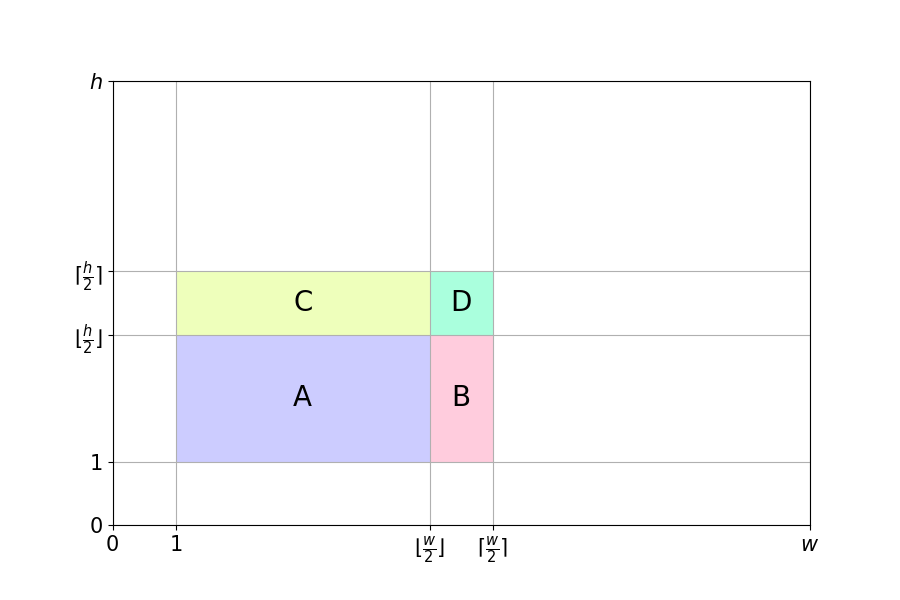
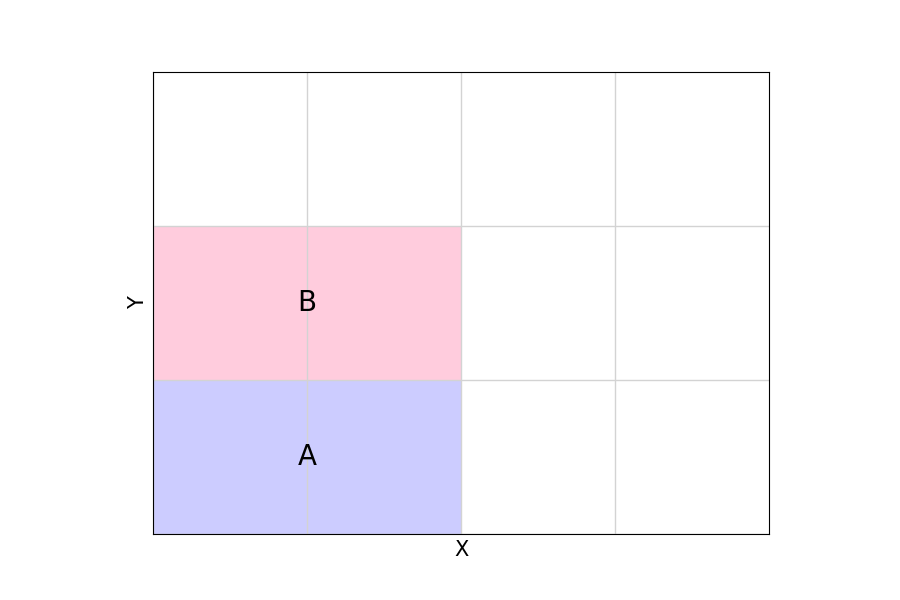

# カタミノの詰め込み種類数を計算

様々なサイズにペントミノを詰め込む問題を考え,
その解の数を計算する.

※ミノの複数形は`minoes`だが, プログラム等では`minos`になっている.

## 計算結果

| サイズ | 10x6 | 12x5 | 15x4 | 20x3 | 11x5 | 10x5 | 9x5  |
| :----: | :--: | :--: | :--: | :--: | :--: | :--: | :--: |
| 種類数 | 2339 | 1010 | 368  |  2   | 4103 | 6951 | 5902 |

| サイズ | 8x5  | 7x5  | 6x5 | 5x5 | 4x5 | 3x5 | 3x4x5 |
| :----: | :--: | :--: | :-: | :-: | :-: | :-: | :---: |
| 種類数 | 3408 | 1396 | 541 | 214 | 50  |  7  | 3940  |

## 高速化

### X ミノを含む 2D 詰め込み

12 個のミノを使って詰め込むときには, `Xミノ` の位置によって場合分けすることで, \
重複の計算を避けることができる.

この画像のように, 全領域の 1/4 を探索すれば,\
そのほかの部分の探索は必要ない.

例えば, X ミノの中心を領域 A に配置したとき, \
左右反転や上下反転した解を重複して探索せずに済む.

### I ミノを含む 3D 詰め込み

`3x4x5`にすべてのミノを詰め込むとき, `Iミノ`が置ける方向は 1 通りしかない.

解を 3x4 平面で切ったときの, I ミノの位置によって場合分けすることで, \
重複を避けることができる.

