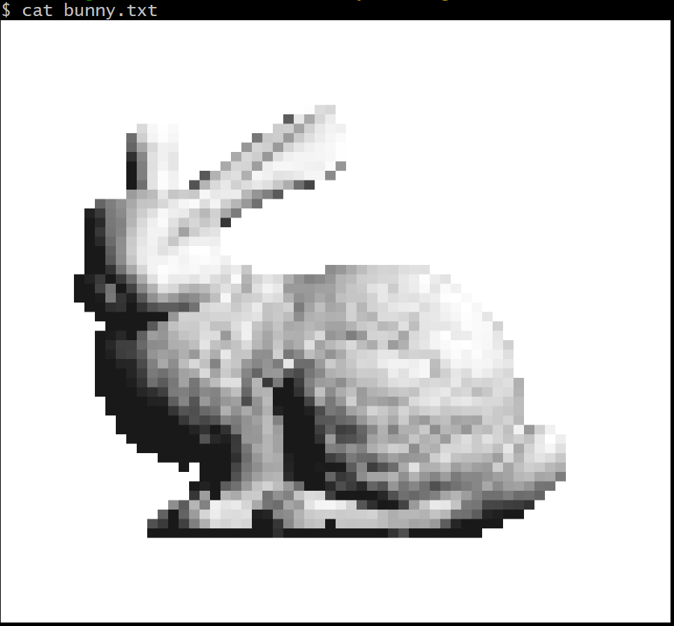

# レイトレで .obj をレンダリング
大学院の授業で作成したプログラム

## 使い方
コンパイルして, 以下のように実行する. \
※実行には `Eigen` の導入が必要です. 

```bash
./ray-tracing <○○.obj> <width> <height>
```

`width` と `height` は出力サイズを表す. 


## 実行結果例
Stanford Bunny をレンダリングしたものを, テキストとして保存したものが `bunny.txt` である.


ナイーブな実装なので実行に時間がかかるが, kd-tree などのデータ構造を用いると高速化できる. 
