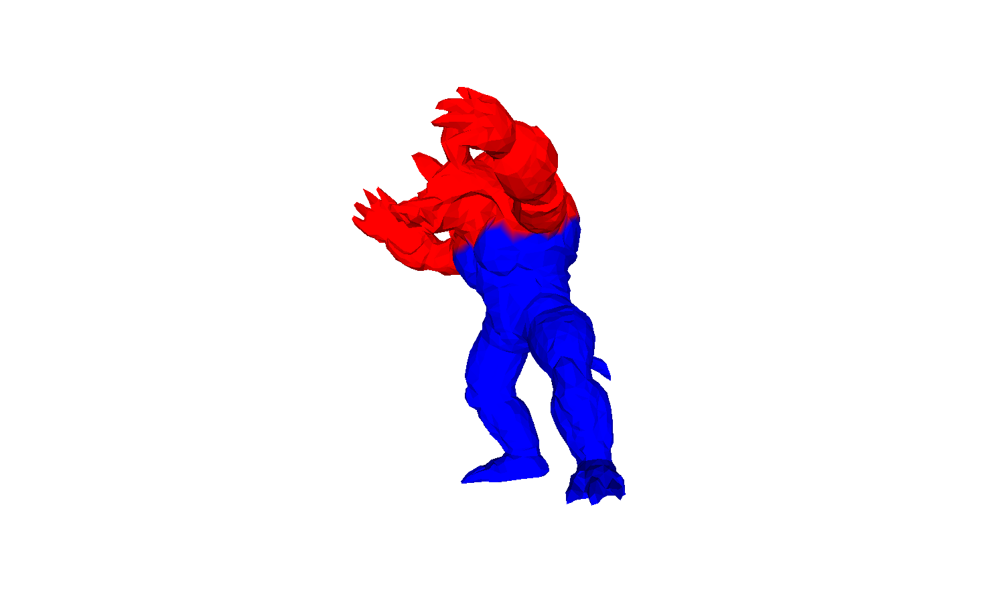
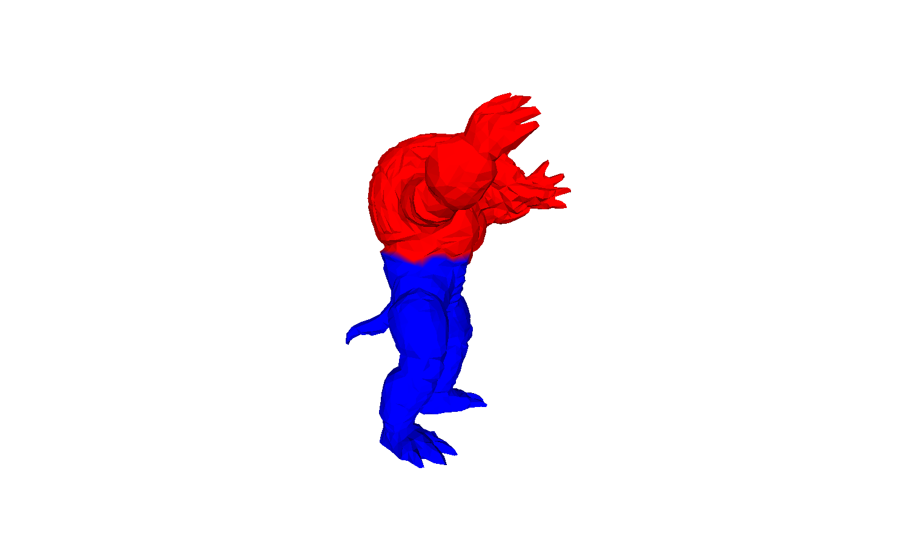
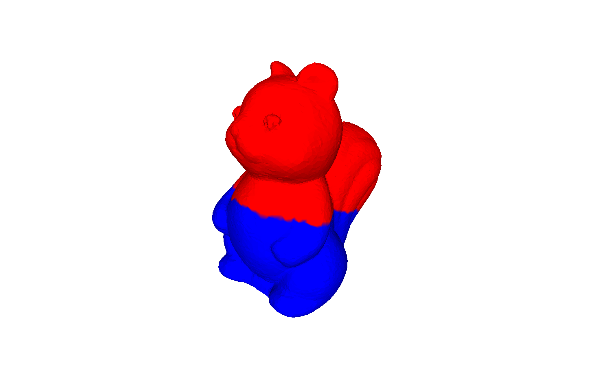

# メッシュ分割プログラム
大学院の授業で作成したプログラム. \
グラフラプラシアンのFiedlerベクトルを用いてメッシュを分割する. 

## 使い方
コンパイルして, 以下のように実行する. \
※実行には `Eigen` と `Spectra` の導入が必要です. 

```bash
./split-mesh <○○.obj(入力)> <○○.obj(出力)> <spd> <is_median>
```

`spd`: 固有ベクトルを求めるためのパラメータ, Spectra の SymEigsSolver で使用する. \
`is_median`: 分割方法, 1: medianカット, 0: signカット.

## 実行結果例

### Armadillo メディアンカット


### Armadillo サインカット


### Squirrel メディアンカット


